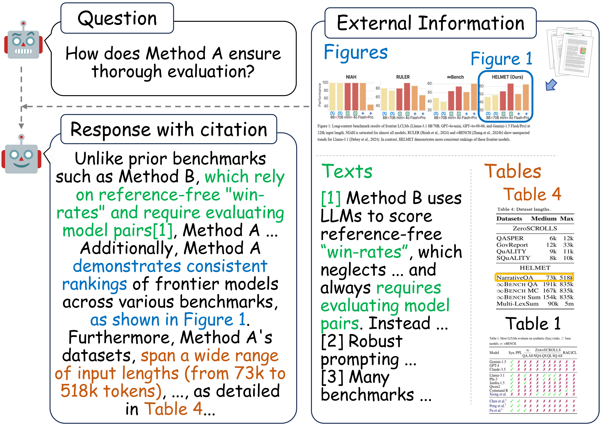
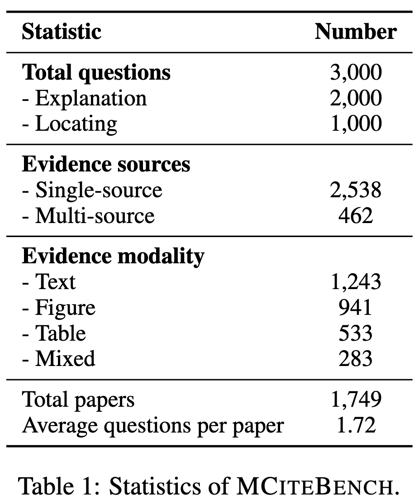

<p align="center">
  <h1 align="center">MCiteBench: A Benchmark for Multimodal Citation Text Generation in MLLMs</h1>
  <p align="center">
    <strong>Caiyu Hu</strong>
    ·
    <strong>Yikai Zhang</strong>
    ·
    <strong>Tinghui Zhu</strong>
    ·
    <strong>Yiwei Ye</strong>
    ·
    <strong>Yanghua Xiao</strong>
  </p>
  <div align="center">
    🌐<a href="https://caiyuhu.github.io/MCiteBench">Homepage</a> | 📖<a href="https://arxiv.org/abs/2503.02589">Paper</a> | 🤗<a href="https://huggingface.co/datasets/caiyuhu/MCiteBench">Huggingface</a>
  </div>
</p>

MCiteBench is a benchmark to evaluate multimodal citation text generation in Multimodal Large Language Models (MLLMs). It includes data from academic papers and review-rebuttal interactions, focusing on citation quality, source reliability, and answer accuracy.
MCiteBench consists of 3,000 samples from 1,749 academic papers, featuring 2,000 Explanation tasks and 1,000 Locating tasks, with balanced evidence across text, figures, tables, and mixed modalities.

An example of multimodal citation text generation and data statistics is shown in the figure below:
<div align="center">
  <table style="margin: 0 auto;">
    <tr>
      <td></td>
      <td></td>
    </tr>
  </table>
</div>

## Setup Environment

Create a conda environment and install dependencies:
```bash
conda create -n MCiteBench python=3.10
conda activate MCiteBench
pip install -r requirements.txt
```

## Runing

### 1. Dataset Download

We provide data samples in the `data` directory, which includes `data/visual_resources_example` and `data/data_example.jsonl`. You can run the entire pipeline with this sample data without needing the full dataset.

If you wish to use the full dataset, please download the [MCiteBench_full_dataset](https://drive.google.com/file/d/16zYXBMCk3h70sfrn7M28VrG3N96mXqEC/view?usp=drive_link) and extract it into the `data` directory. The full dataset will include `data/visual_resources` and `data/data.jsonl`.

Additionally, navigate to `configs/config.json` and modify the following fields:
-  Fill in your OpenAI API key
- "visual_resources_example" for test and "visual_resources" for full dataset
- "data_example" for test and "data" for full dataset
```json
{
    "OPENAI_API_KEY": "YOUR_OPENAI_API_KEY",
    "VISUAL_RESOURCES_DIR": "visual_resources_example",
    "INPUT_QUESTION": "data_example"
}
```

#### Data Format
The data format for `data_example.jsonl` and `data.jsonl` is as follows:

```yaml
question_id: [str]             # The ID of the question
pdf_id: [str]                  # The ID of the associated PDF document
question_type: [str]           # The type of question, with possible values: "explanation" or "locating"
question: [str]                # The text of the question
answer: [str]                  # The answer to the question, which can be a string, list, float, or integer, depending on the context

evidence_keys: [list]          # A list of abstract references or identifiers for evidence, such as "section x", "line y", "figure z", or "table k".
                               # These are not the actual content but pointers or descriptions indicating where the evidence can be found.
                               # Example: ["section 2.1", "line 45", "Figure 3"]
evidence_contents: [list]      # A list of resolved or actual evidence content corresponding to the `evidence_keys`.
                               # These can include text excerpts, image file paths, or table file paths that provide the actual evidence for the answer.
                               # Each item in this list corresponds directly to the same-index item in `evidence_keys`.
                               # Example: ["This is the content of section 2.1.", "/path/to/figure_3.jpg"]
evidence_modal: [str]          # The modality type of the evidence, with possible values: ['figure', 'table', 'text', 'mixed'] indicating the source type of the evidence
evidence_count: [int]          # The total count of all evidence related to the question
distractor_count: [int]        # The total number of distractor items, meaning information blocks that are irrelevant or misleading for the answer
info_count: [int]              # The total number of information blocks in the document, including text, tables, images, etc.
text_2_idx: [dict[str, str]]   # A dictionary mapping text information to corresponding indices
idx_2_text: [dict[str, str]]   # A reverse dictionary mapping indices back to the corresponding text content
image_2_idx: [dict[str, str]]  # A dictionary mapping image paths to corresponding indices
idx_2_image: [dict[str, str]]  # A reverse dictionary mapping indices back to image paths
table_2_idx: [dict[str, str]]  # A dictionary mapping table paths to corresponding indices
idx_2_table: [dict[str, str]]  # A reverse dictionary mapping indices back to table paths
meta_data: [dict]              # Additional metadata used during the construction of the data
distractor_contents: [list]    # Similar to `evidence_contents`, but contains distractors, which are irrelevant or misleading information
```
---
### 2. Generation

#### Supported Models and Usage

This repository provides scripts that support the following models:
- gpt-4o-2024-11-20 / gpt-4o-mini
- Qwen2-VL-7B-Instruct / Qwen2-VL-72B-Instruct
- InternVL2_5-8B / InternVL2_5-78B
- MiniCPM-V-2_6
- llava-onevision-qwen2-7b-ov-hf / llava-onevision-qwen2-7b-ov-chat-hf
- Llama-3.2-11B-Vision-Instruct / Llama-3.2-90B-Vision-Instruct

#### Running Scripts for Different Models

Each model has its own script. Below are the commands to run the respective scripts:

1. gpt-4o-2024-11-20 / gpt-4o-mini
```bash
cd generation
# gpt-4o-2024-11-20 or gpt-4o-mini
python run_api_based.py --model gpt-4o-2024-11-20
```
2. Qwen2-VL-7B-Instruct / Qwen2-VL-72B-Instruct / InternVL2_5-8B / InternVL2_5-78B / MiniCPM-V-2_6
```bash
cd generation
# Specify model name or your local path
python run_vllm_based.py --model Qwen2-VL-7B-Instruct --gpu_num 1 --batch_size 32
```
3. llava-onevision-qwen2-7b-ov-hf / llava-onevision-qwen2-7b-ov-chat-hf
```bash
cd generation
# Specify model name or your local path
CUDA_VISIBLE_DEVICES=0 python run_llava.py --model llava-onevision-qwen2-7b-ov-hf
# Works on 1 GPU
```
4. Llama-3.2-11B-Vision-Instruct / Llama-3.2-90B-Vision-Instruct
```bash
cd generation
# Specify model name or your local path
python run_mllama.py --model Llama-3.2-11B-Vision-Instruct
```
After running the scripts, the corresponding result files will be generated in the `MCiteBench/output/` directory.


### 3. Evaluation

#### 3.1 Answer Accuracy

##### LLM Scoring

```python
cd evaluation/eval_ans_acc
python calculate_ans_acc_score.py
```

After execution, the results will be saved in `MCiteBench/output/answer_acc`. Each JSONL file will contain an additional `answer_rating` field, representing the LLM’s score for each response.

##### Score Calculation

```python
cd evaluation/eval_ans_acc
python calculate_ans_acc_score.py
```

This will create a `MCiteBench/output/answer_acc/ans_acc_scores.csv` file containing the accuracy scores.

---

#### 3.2 Citation F1

##### Splitting Sentence Citations

```
cd evaluation/eval_citation_f1_source_f1_em
python extract_sen_cit_list.py
```

After execution, the `MCiteBench/output/extracted_sen_cit_list` folder will be created. Each JSONL file within will include a `sentence_citation_list field, which contains the split sentences and their corresponding citations.

```json
{
	"sentence_citation_list": [
          {"Sentence": "For example, in Table 4, the \"InternVL2-8b\" model achieves high performance on the DocVQA dataset with 79.48% precision (P) and 47.50% consistency (C).", "Citation": ["Table 4"]},
  	  {"Sentence": "Additionally, Table 6 demonstrates that C&P fine-tuning enhances both cognitive task (C.T.) and perceptual task (P.T.) performance.", "Citation": ["Table 6"]}
        ]
}
```

##### Entailment Judgment

This step should only be run after completing the sentence citation splitting process.

```python
cd evaluation/eval_citation_f1_source_f1_em
python judge_entailment.py
```

After execution, `MCiteBench/output/entailment_judge` will contain the resulting files. Each JSONL file will include recall_list and precision_list fields, with scores corresponding to the sentence-citation pairs in the `sentence_citation_list`.

```json
{
	"sentence_citation_list": [
          {"Sentence": "For example, in Table 4, the \"InternVL2-8b\" model achieves high performance on the DocVQA dataset with 79.48% precision (P) and 47.50% consistency (C).", "Citation": ["Table 4"]},
  	  {"Sentence": "Additionally, Table 6 demonstrates that C&P fine-tuning enhances both cognitive task (C.T.) and perceptual task (P.T.) performance.", "Citation": ["Table 6"]}
        ]
        "recall_list": [{"score": 2}, {"score": 2}], 
        "precision_list": [[{"score": 1}], [{"score": 1}]]
}
```

The scoring for Citation F1/Source F1/Source EM will be calculated together, as outlined below.

---

#### 3.3 Source F1/Source EM

##### Score Calculation

```python
cd evaluation/eval_citation_f1_source_f1_em
python calculate_citation_source_score.py
```

After execution, the `MCiteBench/output/citation_f1_source_f1_em/` folder will be created. This folder will contain the `citation_f1_source_f1_em.csv` file, as well as the modified JSONL files. Specifically, the following fields will be added to each JSONL file to represent key statistics for each response:

```json
{
  "cit_recall": 100.0, 
  "cit_precision": 50.0, 
  "cit_f1": 66.66666666666666, 
  "source_recall": 50.0, 
  "source_precision": 50.0, 
  "source_f1": 50.0, 
  "source_recall_em": 0.0, 
  "source_precision_em": 0.0, 
  "source_f1_em": 0.0
}
```

